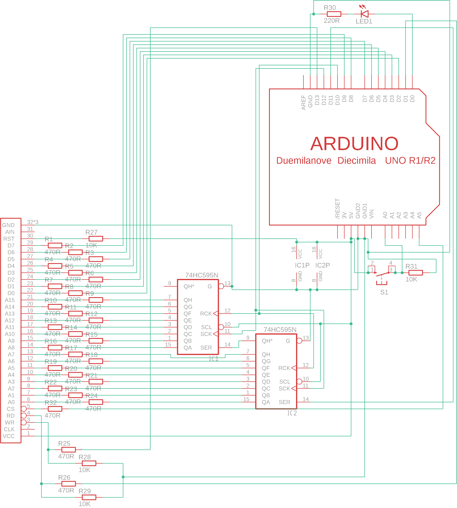

# GB-Cartridge-Reader-Writer

This is an Arduino Shield, that can be used to dump GameBoy cartridges. This project is strongly inspired by this project:

* https://www.insidegadgets.com/2011/03/19/gbcartread-arduino-based-gameboy-cart-reader-%E2%80%93-part-1-read-the-rom/
* https://github.com/insidegadgets/GBCartRead

The code in this repo is based on this, however I did a lot of changes to the Arduino code.

# Eagle Layout for the Arduino shield

The bottom layer is supposed to be wired with a simple wire to be able to use a single layer pcb.

Used libraries (see submodules):

* https://github.com/adafruit/Adafruit-Eagle-Library
* https://github.com/robelix/rlx-eagle-libs
* https://github.com/JRodrigoTech/Eagle-Libraries

# License

Copyright (c) 2011-2016 by insideGadgets

Copyright (c) 2019-2020 by Felix Weichselgartner (on the changes)

Creative Commons - Attribution-NonCommercial 3.0 Unported (see License.txt)
